# Project: NYC Restaurant Inspection Data

**Noé Breton** et **Reda Bourssouf**

## Installations de Elastic Search

On utilise docker compose et la commande ```docker compose up -d``` pour lancer elasticsearch et kibana.

```
version: '3.8'

services:
  elasticsearch:
    image: docker.elastic.co/elasticsearch/elasticsearch:8.4.2
    container_name: elasticsearch
    environment:
      - node.name=elasticsearch
      - cluster.name=es-docker-cluster
      - discovery.type=single-node
      - bootstrap.memory_lock=true
      - "ES_JAVA_OPTS=-Xms512m -Xmx512m"
      # Security settings for development
      - xpack.security.enabled=false
      - xpack.security.enrollment.enabled=false
      - xpack.security.http.ssl.enabled=false
      - xpack.security.transport.ssl.enabled=false
    ulimits:
      memlock:
        soft: -1
        hard: -1
    volumes:
      - es_data:/usr/share/elasticsearch/data
    ports:
      - "9200:9200"
      - "9300:9300"
    networks:
      - elastic
    healthcheck:
      test: ["CMD-SHELL", "curl -f http://localhost:9200/_cluster/health || exit 1"]
      interval: 30s
      timeout: 10s
      retries: 5

  kibana:
    image: docker.elastic.co/kibana/kibana:8.4.2
    container_name: kibana
    environment:
      - ELASTICSEARCH_HOSTS=http://elasticsearch:9200
      - ELASTICSEARCH_USERNAME=kibana_system
      - ELASTICSEARCH_PASSWORD=
    ports:
      - "5601:5601"
    networks:
      - elastic
    depends_on:
      elasticsearch:
        condition: service_healthy
    healthcheck:
      test: ["CMD-SHELL", "curl -f http://localhost:5601/api/status || exit 1"]
      interval: 30s
      timeout: 10s
      retries: 5

volumes:
  es_data:
    driver: local

networks:
  elastic:
    driver: bridge
```

## Ingestion
On cherche a ingerer [NYC Restaurant Inspection Results](https://data.cityofnewyork.us/Health/DOHMH-New-York-City-Restaurant-Inspection-Results/43nn-pn8j/about_data).

La taille limite de fichier à ingérer est par défaut de 100 MB. Malheureusement, le fichier CSV à ingérer fait 123 MB. Nous modifions donc la limite à 150 MB dans les paramètres avancés.

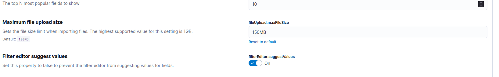


## 2. Questions

### 2.1 List all the neighborhoods in New York.

Par une agrégation sur la colonne **BORO**, on récupère les **quartiers uniques** ainsi que leur **nombre d’occurrences**.

Request:
```
GET /restaurantny/_search
{
  "size": 0,
  "aggs": {
    "unique_boro": {
      "terms": {
        "field": "BORO",
        "size": 100
      }
    }
  }
}
```
Response:
```
  "aggregations": {
    "unique_boro": {
      "doc_count_error_upper_bound": 0,
      "sum_other_doc_count": 0,
      "buckets": [
        {
          "key": "Manhattan",
          "doc_count": 106988
        },
        {
          "key": "Brooklyn",
          "doc_count": 74803
        },
        {
          "key": "Queens",
          "doc_count": 71095
        },
        {
          "key": "Bronx",
          "doc_count": 26613
        },
        {
          "key": "Staten Island",
          "doc_count": 10071
        }
      ]
    }
  }
}
```

### Visalisation


Par cette visualisation on peut voir clairement tout les quartier de new york et les restautant present a l'interieur, divisé par zipcode.

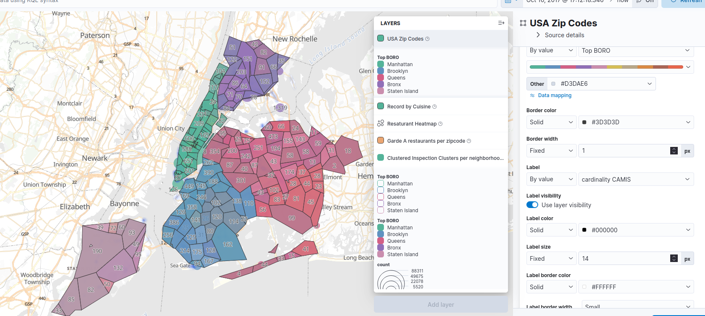

### 2.2 Which neighborhood has the most restaurants ?

Reprendre la visualisation précédente ne permet pas de voir clairement quel restaurant possède le plus grand nombre d’établissements.
L’outil de clustering ne permet pas d’utiliser le nombre exact de restaurants tout en colorant les clusters par quartier.

On utilise ensuite une seconde agrégation de cardinalité sur l’ID unique du restaurant afin d’obtenir le nombre total de restaurants unique.

Request:
```
GET restaurantny/_search
{
  "size": 0,
  "aggs": {
    "restaurants_by_boro": {
      "terms": {
        "field": "BORO",
        "size": 1,
        "order": { "unique_restaurants.value": "desc" }
      },
      "aggs": {
        "unique_restaurants": {
          "cardinality": {
            "field": "CAMIS"
          }
        }
      }
    }
  }
}
```

Resulat:

```
"aggregations": {
    "restaurants_by_boro": {
      "doc_count_error_upper_bound": 0,
      "sum_other_doc_count": 182582,
      "buckets": [
        {
          "key": "Manhattan",
          "doc_count": 106988,
          "unique_restaurants": {
            "value": 12113
          }
        }
      ]
    }
  }
}
```

Manahattan possède 12113 restaurant, faisant de ce quartier celui avec la plus grande offre de restauration.

#### visualitation

Reprendre la visualisation précédente ne permet pas de visualisé clairement quel restaurant a le plus grand nombre de restaurant, l'outil de cluster ne permet pas d'utiliser le nombre de restaurant exact tout en coloarant les clusters par quartier.


Comme sur la heatmap, on remarque une plus grande densité à Manhattan, mais cela reste moins évident qu’avec un barchart.
On utilise donc un unique count sur CAMIS afin de ne compter que les restaurants uniques.

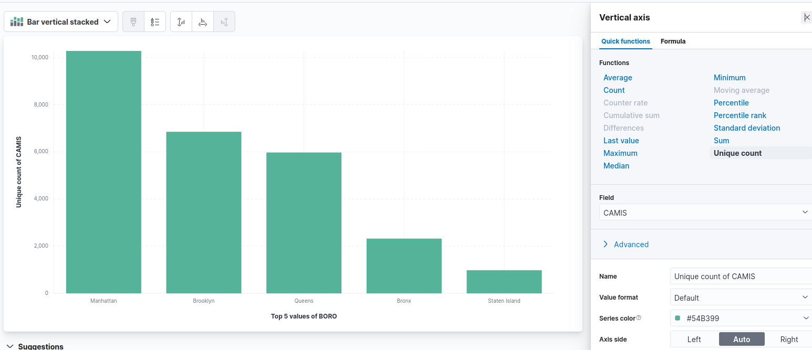


On peux appercevoir la repartition des restaurant de new york par BORO.

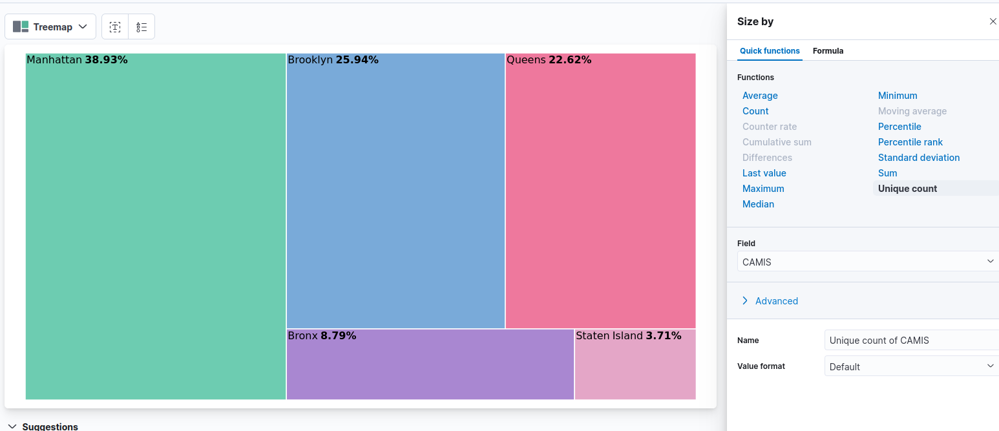

### 2.3 What does the violation code "04N" correspond to ?

On extrait les attributs VIOLATION DESCRIPTION (et VIOLATION CODE, pour vérification) d’une ligne dont l’attribut VIOLATION CODE a pour valeur 04N.

Requete
```
GET restaurantny/_search
{
  "_source": ["VIOLATION DESCRIPTION","VIOLATION CODE"],
  "query": {
    "term": {
      "VIOLATION CODE": "04N"
    }
  },
  "size": 1
}
```


Resultat
```
    "hits": [
      {
        "_index": "restaurantny",
        "_id": "rBOH3JkByv84jpscZM78",
        "_score": 3.1635146,
        "_source": {
          "VIOLATION CODE": "04N",
          "VIOLATION DESCRIPTION": "Filth flies or food/refuse/sewage associated with (FRSA) flies or other nuisance pests in establishment’s food and/or non-food areas. FRSA flies include house flies, blow flies, bottle flies, flesh flies, drain flies, Phorid flies and fruit flies."
        }
      }
    ]
  }
}
```
Le code 04N correspond à la présence de mouches ou d’autres insectes dans les zones de préparation, de stockage ou de service des aliments.

#### viusalitation

Voici la proportion des codes de violation présents dans les restaurants enregistrés.
On observe que le code 10F est le plus fréquent, en incluant les lignes ne présentant pas de code.
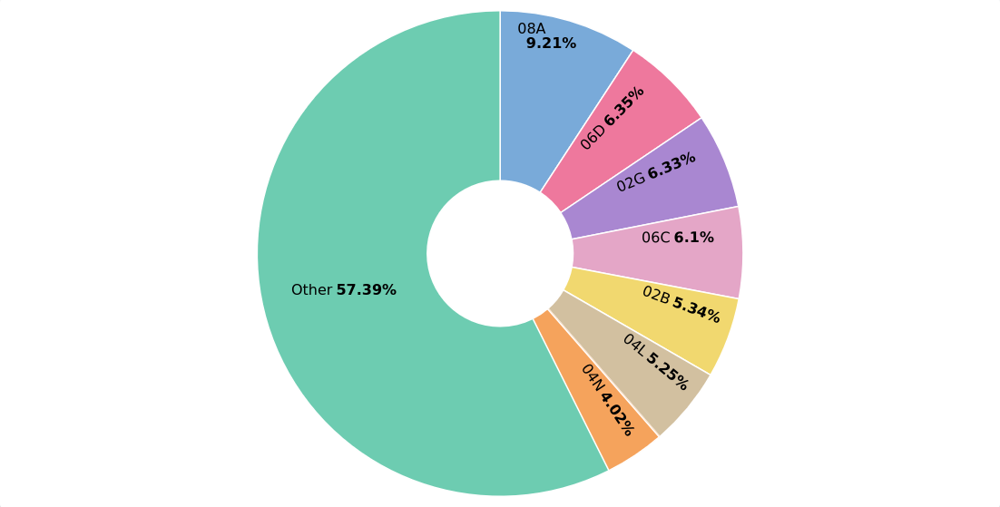


### 2.4 Where are the restaurants (name, address, neighborhood) that have a grade of A?


La requète naïve donne une liste des restaurant avec un grade de A (l'enoncé ne precise pas si on cherche a affiner la recherche en regardant les restaurant dont la derniere note est A)
```
  GET restaurantny/_search
{
  "_source": ["DBA","BUILDING","STREET","ZIPCODE","BORO","GRADE"],
  "query": {
    "term": {
      "GRADE": "A"
    }
  },"size": 100

}

```
response :

```
 "hits": [
      {
        "_index": "restaurantny",
        "_id": "rROH3JkByv84jpscZM78",
        "_score": 0.3891273,
        "_source": {
          "DBA": "PRESSED JUICERY",
          "BUILDING": "2857",
          "BORO": "Manhattan",
          "ZIPCODE": 10025,
          "GRADE": "A",
          "STREET": "BROADWAY"
        }
      },
      {
        "_index": "restaurantny",
        "_id": "sBOH3JkByv84jpscZM78",
        "_score": 0.3891273,
        "_source": {
          "DBA": "KPOT KOREAN BBQ & HOT POT (ON 2ND FL, BAY PLAZA MALL)",
          "BUILDING": "200",
          "BORO": "Bronx",
          "ZIPCODE": 10475,
          "GRADE": "A",
          "STREET": "BAYCHESTER AVENUE"
        }
      },
      {
        "_index": "restaurantny",
        "_id": "shOH3JkByv84jpscZM78",
        "_score": 0.3891273,
        "_source": {
          "DBA": "BLUE MOUNTAIN REST & BAKERY",
          "BUILDING": "959",
          "BORO": "Brooklyn",
          "ZIPCODE": 11226,
          "GRADE": "A",
          "STREET": "FLATBUSH AVENUE"
        }
      },
      {
        "_index": "restaurantny",
        "_id": "tBOH3JkByv84jpscZM78",
        "_score": 0.3891273,
        "_source": {
          "DBA": "Bronx Slice",
          "BUILDING": "37",
          "BORO": "Bronx",
          "ZIPCODE": 10454,
          "GRADE": "A",
          "STREET": "BRUCKNER BOULEVARD"
        }
      },
      {
        "_index": "restaurantny",
        "_id": "txOH3JkByv84jpscZM78",
        "_score": 0.3891273,
        "_source": {
          "DBA": "CJ DIAMOND CAFE",
          "BUILDING": "4102",
          "BORO": "Queens",
          "ZIPCODE": 11355,
          "GRADE": "A",
          "STREET": "COLLEGE POINT BLVD"
        }
      },...
```

requète avec tri :


#### Visualisation

L’outil de visualisation n’autorise pas l’utilisation de DBA comme métrique. J’ai donc choisi de visualiser la proportion des notes parmi l’ensemble des restaurants. Les outils dynamiques du dashboard permettront ensuite d’ajuster la granularité.

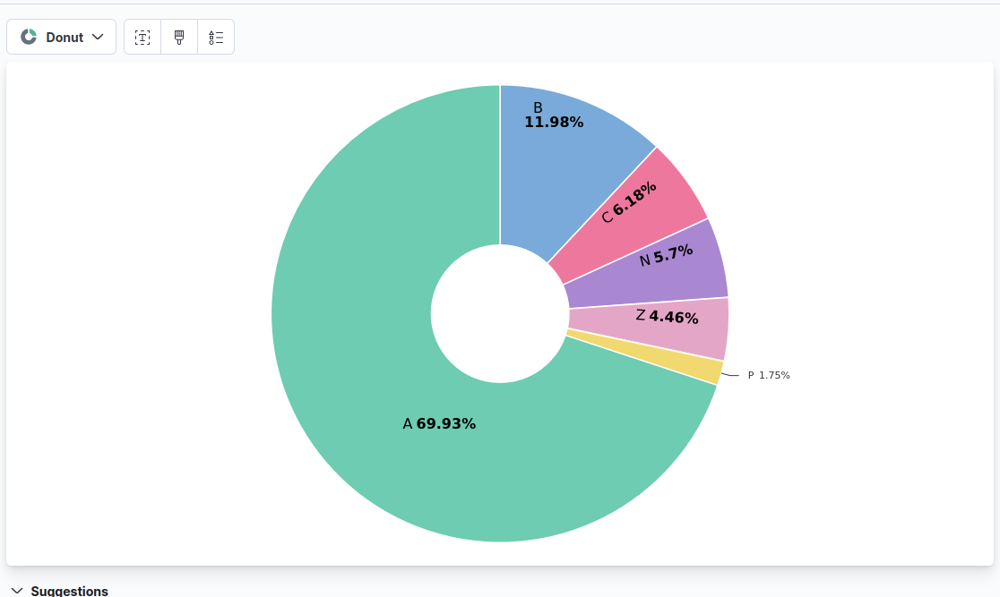

On peut également ajouter la médiane des scores par BORO. On découvre alors que le Queens présente la meilleure médiane parmi tous les BORO.
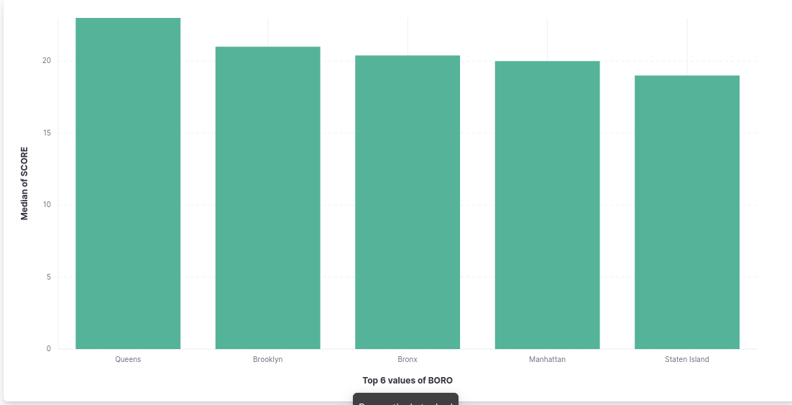

### 2.5 What is the most popular cuisine? And by neighborhood?

```GET restaurantny/_search
GET restaurantny_final/_search
{
  "size": 0,

  "aggs": {
    "top3_Description": {
      "terms": {
        "field": "CUISINE DESCRIPTION",
        "size": 3,
        "order": { "unique_restaurants.value": "desc" }
      },
      "aggs": {
        "unique_restaurants": {
          "cardinality": {
            "field": "CAMIS"
                      }
        }
      }
    }
  }
}
```
response:
```
  "aggregations": {
    "top3_Description": {
      "doc_count_error_upper_bound": -1,
      "sum_other_doc_count": 192398,
      "buckets": [
        {
          "key": "American",
          "doc_count": 45070,
          "unique_restaurants": {
            "value": 4929
          }
        },
        {
          "key": "Chinese",
          "doc_count": 28142,
          "unique_restaurants": {
            "value": 2154
          }
        },
        {
          "key": "Coffee/Tea",
          "doc_count": 20167,
          "unique_restaurants": {
            "value": 2100
          }
        }
      ]
    }
  }
```

La cuisine la plus populaire de New York, en nombre de restaurants, est la cuisine américaine, avec 4 964 établissements, suivie par la cuisine chinoise et les coffee/tea shops.

Par Voisinage:

```
GET restaurantny_final/_search
{
  "size": 0,

  "aggs": {
    "by_boro": {
      "terms": {
        "field": "BORO",
        "size": 10
      },
  "aggs": {
    "top3_Description": {
      "terms": {
        "field": "CUISINE DESCRIPTION",
        "size": 1,
        "order": { "unique_restaurants.value": "desc" }
      },
      "aggs": {
        "unique_restaurants": {
          "cardinality": {
            "field": "CAMIS"
                      }
        }
      }
    }
    }
    }
  }
}
```

reponse:
```
"aggregations": {
    "by_boro": {
      "doc_count_error_upper_bound": 0,
      "sum_other_doc_count": 0,
      "buckets": [
        {
          "key": "Manhattan",
          "doc_count": 106988,
          "top3_Description": {
            "doc_count_error_upper_bound": -1,
            "sum_other_doc_count": 82973,
            "buckets": [
              {
                "key": "American",
                "doc_count": 22371,
                "unique_restaurants": {
                  "value": 2476
                }
              }
            ]
          }
        },
        {
          "key": "Brooklyn",
          "doc_count": 74803,
          "top3_Description": {
            "doc_count_error_upper_bound": -1,
            "sum_other_doc_count": 63742,
            "buckets": [
              {
                "key": "American",
                "doc_count": 10057,
                "unique_restaurants": {
                  "value": 1094
                }
              }
            ]
          }
        },
        {
          "key": "Queens",
          "doc_count": 71095,
          "top3_Description": {
            "doc_count_error_upper_bound": -1,
            "sum_other_doc_count": 62322,
            "buckets": [
              {
                "key": "American",
                "doc_count": 7988,
                "unique_restaurants": {
                  "value": 854
                }
              }
            ]
          }
        },
        {
          "key": "Bronx",
          "doc_count": 26613,
          "top3_Description": {
            "doc_count_error_upper_bound": -1,
            "sum_other_doc_count": 23433,
            "buckets": [
              {
                "key": "American",
                "doc_count": 2948,
                "unique_restaurants": {
                  "value": 317
                }
              }
            ]
          }
        },
        {
          "key": "Staten Island",
          "doc_count": 10071,
          "top3_Description": {
            "doc_count_error_upper_bound": -1,
            "sum_other_doc_count": 8237,
            "buckets": [
              {
                "key": "American",
                "doc_count": 1706,
                "unique_restaurants": {
                  "value": 164
                }
              }
            ]
```

par BORO, la cuisine la plus populaire est

| **BORO**          | **Cuisine la plus populaire** | **Nombre de restaurants** |
| ----------------- | ----------------------------- | ------------------------- |
| **Manhattan**     | American                      | 2476                    |
| **Brooklyn**      | American                      | 1094                    |
| **Queens**        | American                       | 854                     |
| **Bronx**         | American                      | 317                    |
| **Staten Island** | American                      | 164                     |


#### visualisation

Pour New York, on peut utiliser un pie chart classique ou un waffle chart (dont la visibilité reste toutefois moins bonne).

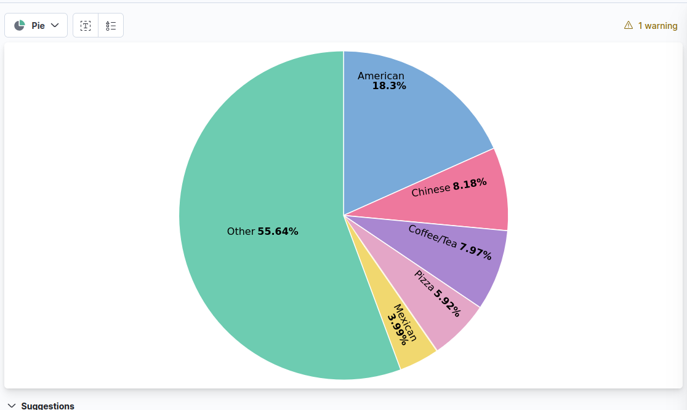

On peut utiliser un double pie chart ou une mosaïque afin de visualiser la cuisine la plus populaire par BORO.

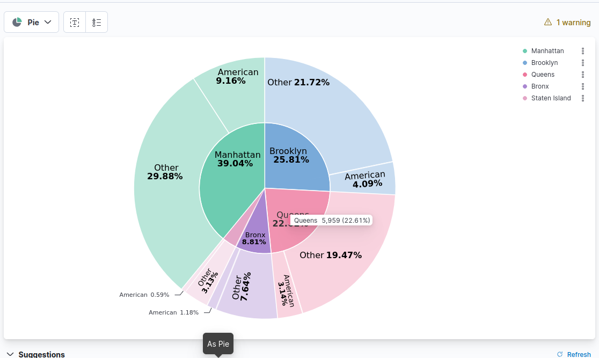

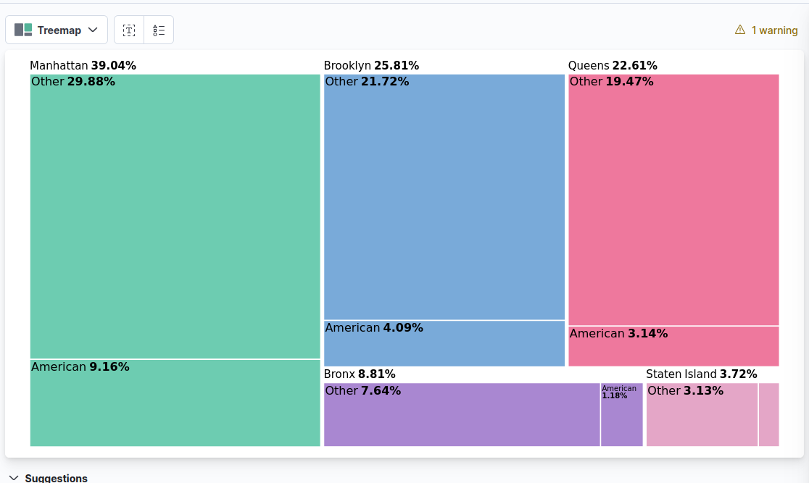
### 2.6 What is the date of the last inspection?

```

GET restaurantny/_search
{
  "_source": ["INSPECTION DATE","DBA"],
  "sort": [
    { "INSPECTION DATE": { "order": "desc" } }
  ],
  "size": 1
}
```

reponse :
```
   "hits": [
      {
        "_index": "restaurantny",
        "_id": "UBOH3JkByv84jpscW10l",
        "_score": null,
        "_source": {
          "DBA": "LE PETIT MONSTRE",
          "INSPECTION DATE": "10/09/2025"
        },
        "sort": [
          1759968000000
        ]
      }
```

La dernière inspection date du 10/09/2025 et concerne le restaurant LE PETIT MONSTRE.

#### visulation

On peut utiliser un diagramme temporel en barres ou en lignes pour visualiser l’évolution du nombre d’inspections au fil du temps.

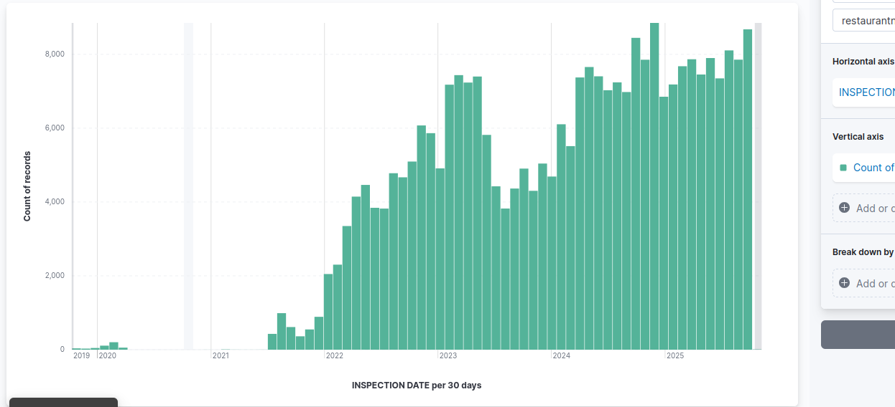


### 2.7 Provide a list of Chinese restaurants with an A grade in Brooklyn.

On utilise la commande bool pour trouver les restaurants qui doivent (must) remplir les conditions suivantes : "CUISINE DESCRIPTION": "Chinese", "GRADE": "A" et "BORO": "Brooklyn".

```
GET restaurantny/_search
{
  "_source": ["DBA"],
  "query": {
    "bool": {
      "must": [
        { "term": { "CUISINE DESCRIPTION": "Chinese" } },
        { "term": { "GRADE": "A" } },
        { "term": { "BORO": "Brooklyn" } }
      ]
    }
  }
}
```

resultat:
```
 "hits": [
      {
        "_index": "restaurantny",
        "_id": "rBOH3JkByv84jpscZM_8",
        "_score": 4.0605974,
        "_source": {
          "DBA": "NEW CENTURY CHINESE RESTAURANT"
        }
      },
      {
        "_index": "restaurantny",
        "_id": "HhOH3JkByv84jpscZND8",
        "_score": 4.0605974,
        "_source": {
          "DBA": "NEW GREAT WALL 1419"
        }
      },
      {
        "_index": "restaurantny",
        "_id": "nhOH3JkByv84jpscZND8",
        "_score": 4.0605974,
        "_source": {
          "DBA": "FOOD LOVER BAKERY"
        }
      },
      {
        "_index": "restaurantny",
        "_id": "UROH3JkByv84jpscZNH8",
        "_score": 4.0605974,
        "_source": {
          "DBA": "SUN GARDEN"
        }
      },
      {
        "_index": "restaurantny",
        "_id": "WROH3JkByv84jpscZNH8",
        "_score": 4.0605974,
        "_source": {
          "DBA": "GRAND PANDA"
        }
      },
      {...
```

#### Visualisation

On peut utiliser les contrôles afin d’obtenir une liste des restaurants correspondant à ces critères.

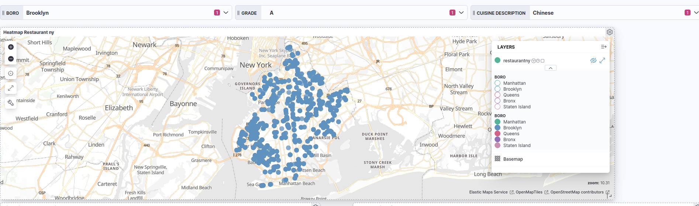

### 2.8 Provide the address of the restaurant LADUREE

En effectuant une requête match, on découvre qu’il existe plusieurs restaurants LADURÉE (LADURÉE, LADURÉE Soho et LADURÉE).

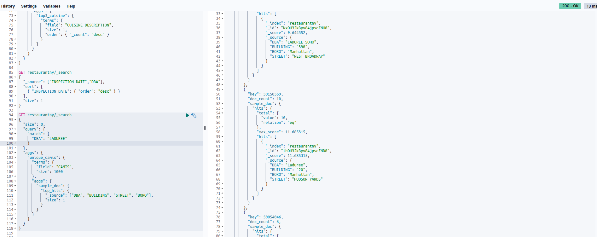

On essaie une requête pour obtenir le terme exact "LADURÉE", mais cela ne fonctionne toujours pas, comme si DBA ne permettait pas une recherche exacte. En inspectant le mapping, on s’aperçoit que DBA ne possède pas l’option "keyword", nécessaire pour ce type de recherche (contrairement à GRADE, par exemple). On ajoute donc un champ keyword à DBA dans un nouvel index.

mapping de GRADE
```
{
  "restaurantny": {
    "mappings": {
      "GRADE": {
        "full_name": "GRADE",
        "mapping": {
          "GRADE": {
            "type": "keyword"
          }
        }
      }
    }
  }
}
```

mapping de DBA

```
{
  "restaurantny": {
    "mappings": {
      "DBA": {
        "full_name": "DBA",
        "mapping": {
          "DBA": {
            "type": "text"
          }
        }
      }
    }
  }
}
```

ajout de keyword a DBA a restaurant NY v1

```
PUT restaurantny_v1
{
  "mappings": {
    "properties": {
      "DBA": {
        "type": "text",
        "fields": {
          "keyword": { "type": "keyword" }
        }
      }    }
  }
}
```
reindexation

```
POST _reindex
{
  "source": { "index": "restaurantny" },
  "dest":   { "index": "restaurantny_v1" }
}
```

On ressaye la requete, on aggress sur le numero CAMIS pour être sur d'avoir la liste des restaurant unique en fonction de leur ID appelé LADUREE, on met la size de la seconde agreggation a 1 pour ne pas avoir des doublons en cas de multiple inspections.

```GET restaurantny_v1/_search
{
  "size": 0,
  "query": {
    "term": {
      "DBA.keyword": "LADUREE"
    }
  },
  "aggs": {
    "unique_CAMIS": {
      "terms": {
        "field": "CAMIS",
        "size": 100
      },
      "aggs": {
        "sample_doc": {
          "top_hits": {
            "_source": ["DBA", "BUILDING", "STREET", "BORO"],
            "size": 1
          }
        }
      }
    }
  }
}

```

resultat

```
{
  "took": 0,
  "timed_out": false,
  "_shards": {
    "total": 1,
    "successful": 1,
    "skipped": 0,
    "failed": 0
  },
  "hits": {
    "total": {
      "value": 6,
      "relation": "eq"
    },
    "max_score": null,
    "hits": []
  },
  "aggregations": {
    "unique_CAMIS": {
      "doc_count_error_upper_bound": 0,
      "sum_other_doc_count": 0,
      "buckets": [
        {
          "key": 50054046,
          "doc_count": 6,
          "sample_doc": {
            "hits": {
              "total": {
                "value": 6,
                "relation": "eq"
              },
              "max_score": 10.704353,
              "hits": [
                {
                  "_index": "restaurantny_v1",
                  "_id": "jhWH3JkByv84jpsclOJK",
                  "_score": 10.704353,
                  "_source": {
                    "DBA": "LADUREE",
                    "BUILDING": "864",
                    "BORO": "Manhattan",
                    "STREET": "MADISON AVENUE"
                  }
                }
              ]
            }
          }
        }
      ]
    }
  }
}
```


l'adresse du restautant LADUREE est 864 MADISON AVENUE,Manhattan.

#### visulisation

Pour visualiser avec les nouveaux filtres, on met à jour notre Data View afin d’utiliser le nouvel index. Cependant, je me suis aperçu que le réindexage n’avait pas pris en compte les dates ni la location. Je corrige donc le réindexage pour inclure ces champs.

mapping de restaurantny
```
{
  "restaurantny": {
    "mappings": {
      "_meta": {
        "created_by": "file-data-visualizer"
      },
      "properties": {
        "@timestamp": {
          "type": "date"
        },
        "ACTION": {
          "type": "text"
        },
        "BBL": {
          "type": "long"
        },
        "BIN": {
          "type": "long"
        },
        "BORO": {
          "type": "keyword"
        },
        "BUILDING": {
          "type": "keyword"
        },
        "CAMIS": {
          "type": "long"
        },
        "CRITICAL FLAG": {
          "type": "keyword"
        },
        "CUISINE DESCRIPTION": {
          "type": "keyword"
        },
        "Census Tract": {
          "type": "long"
        },
        "Community Board": {
          "type": "long"
        },
        "Council District": {
          "type": "long"
        },
        "DBA": {
          "type": "text"
        },
        "GRADE": {
          "type": "keyword"
        },
        "GRADE DATE": {
          "type": "date",
          "format": "MM/dd/yyyy"
        },
        "INSPECTION DATE": {
          "type": "date",
          "format": "MM/dd/yyyy"
        },
        "INSPECTION TYPE": {
          "type": "keyword"
        },
        "Latitude": {
          "type": "double"
        },
        "Longitude": {
          "type": "double"
        },
        "NTA": {
          "type": "keyword"
        },
        "PHONE": {
          "type": "keyword"
        },
        "RECORD DATE": {
          "type": "date",
          "format": "MM/dd/yyyy"
        },
        "SCORE": {
          "type": "long"
        },
        "STREET": {
          "type": "keyword"
        },
        "VIOLATION CODE": {
          "type": "keyword"
        },
        "VIOLATION DESCRIPTION": {
          "type": "text"
        },
        "ZIPCODE": {
          "type": "long"
        },
        "location": {
          "type": "geo_point"
        }
      }
    }
  }
}
```

Mapping de restaurantny_v1
```
{
  "restaurantny_v1": {
    "mappings": {
      "properties": {
        "@timestamp": {
          "type": "date"
        },
        "ACTION": {
          "type": "text",
          "fields": {
            "keyword": {
              "type": "keyword",
              "ignore_above": 256
            }
          }
        },
        "BBL": {
          "type": "long"
        },
        "BIN": {
          "type": "long"
        },
        "BORO": {
          "type": "text",
          "fields": {
            "keyword": {
              "type": "keyword",
              "ignore_above": 256
            }
          }
        },
        "BUILDING": {
          "type": "text",
          "fields": {
            "keyword": {
              "type": "keyword",
              "ignore_above": 256
            }
          }
        },
        "CAMIS": {
          "type": "long"
        },
        "CRITICAL FLAG": {
          "type": "text",
          "fields": {
            "keyword": {
              "type": "keyword",
              "ignore_above": 256
            }
          }
        },
        "CUISINE DESCRIPTION": {
          "type": "text",
          "fields": {
            "keyword": {
              "type": "keyword",
              "ignore_above": 256
            }
          }
        },
        "Census Tract": {
          "type": "long"
        },
        "Community Board": {
          "type": "long"
        },
        "Council District": {
          "type": "long"
        },
        "DBA": {
          "type": "text",
          "fields": {
            "keyword": {
              "type": "keyword"
            }
          }
        },
        "GRADE": {
          "type": "text",
          "fields": {
            "keyword": {
              "type": "keyword",
              "ignore_above": 256
            }
          }
        },
        "GRADE DATE": {
          "type": "text",
          "fields": {
            "keyword": {
              "type": "keyword",
              "ignore_above": 256
            }
          }
        },
        "INSPECTION DATE": {
          "type": "text",
          "fields": {
            "keyword": {
              "type": "keyword",
              "ignore_above": 256
            }
          }
        },
        "INSPECTION TYPE": {
          "type": "text",
          "fields": {
            "keyword": {
              "type": "keyword",
              "ignore_above": 256
            }
          }
        },
        "Latitude": {
          "type": "float"
        },
        "Longitude": {
          "type": "float"
        },
        "NTA": {
          "type": "text",
          "fields": {
            "keyword": {
              "type": "keyword",
              "ignore_above": 256
            }
          }
        },
        "PHONE": {
          "type": "text",
          "fields": {
            "keyword": {
              "type": "keyword",
              "ignore_above": 256
            }
          }
        },
        "RECORD DATE": {
          "type": "text",
          "fields": {
            "keyword": {
              "type": "keyword",
              "ignore_above": 256
            }
          }
        },
        "SCORE": {
          "type": "long"
        },
        "STREET": {
          "type": "text",
          "fields": {
            "keyword": {
              "type": "keyword",
              "ignore_above": 256
            }
          }
        },
        "VIOLATION CODE": {
          "type": "text",
          "fields": {
            "keyword": {
              "type": "keyword",
              "ignore_above": 256
            }
          }
        },
        "VIOLATION DESCRIPTION": {
          "type": "text",
          "fields": {
            "keyword": {
              "type": "keyword",
              "ignore_above": 256
            }
          }
        },
        "ZIPCODE": {
          "type": "long"
        },
        "location": {
          "type": "text",
          "fields": {
            "keyword": {
              "type": "keyword",
              "ignore_above": 256
            }
          }
        }
      }
    }
  }
}
```

On recommance l'indexation
```
PUT restaurantny_v1
{
  "mappings": {
    "properties": {
      "DBA": {
        "type": "text",
        "fields": {
          "keyword": { "type": "keyword" }
        }
      },
              "INSPECTION DATE": {
          "type": "date",
          "format": "MM/dd/yyyy"
        },
             "GRADE DATE": {
          "type": "date",
          "format": "MM/dd/yyyy"
        },
                "RECORD DATE": {
          "type": "date",
          "format": "MM/dd/yyyy"
        },        "location": {
          "type": "geo_point"
        }
      }

    }
}
```
On peut finalement visualiser la localisation du restaurant LADURÉE.

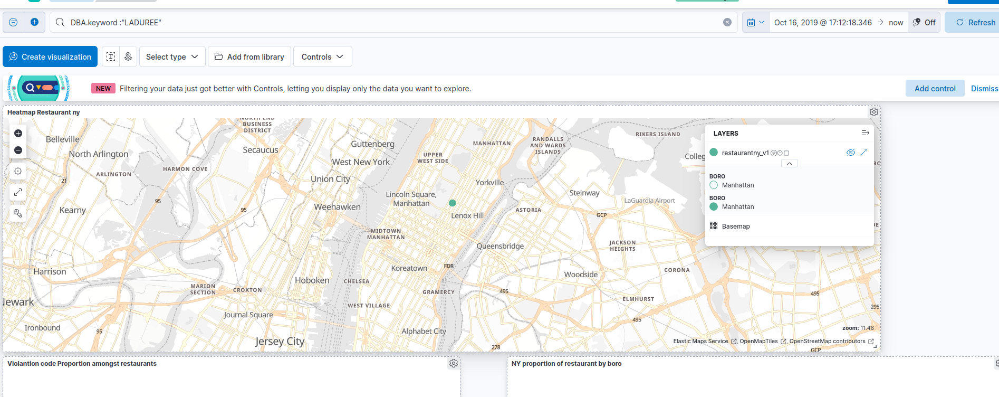

Cette méthode peut provoquer des erreurs de typage en raison d’une mauvaise spécification de tous les types ; par exemple, lors du réindexage, plusieurs champs de type keyword se sont transformés en champs text avec un attribut keyword.

Autre possibilité :

* Pour les petits datasets, réimporter les données en ajoutant directement l’attribut keyword au champ DBA.

* Ajouter un champ DBA_keyword à l’index de base, mais cela serait moins optimisé, car les deux champs seraient stockés et indexés différemment.


### 2.9 Identify the cuisine most affected by the violation “Hot food item not held at or above 140º F”

Pour cette requête, on peut utiliser match_phrase afin de trouver la phrase exacte (sensible à la casse), ou match, mais dans ce cas il faut ajuster le paramètre fuzziness pour éviter d’obtenir des résultats dont la description est trop différente.

requète:
```
GET restaurantny/_search
{
  "size": 0,
  "query": {
    "match_phrase": {
      "VIOLATION DESCRIPTION": "Hot food item not held at or above 140º F"
    }
  },
  "aggs": {
    "most_affected_cuisine": {
      "terms": {
        "field": "CUISINE DESCRIPTION",
        "size": 10,
        "order": { "_count": "desc" }
      }
    }
  }
}
```

resultat
```
 "aggregations": {
    "most_affected_cuisine": {
      "doc_count_error_upper_bound": 0,
      "sum_other_doc_count": 401,
      "buckets": [
        {
          "key": "Pizza",
          "doc_count": 187
        },
        {
          "key": "American",
          "doc_count": 179
        },
        {
          "key": "Chinese",
          "doc_count": 174
        },
        {
          "key": "Latin American",
          "doc_count": 84
        },
        {
          "key": "Caribbean",
          "doc_count": 80
        },
        {
          "key": "Japanese",
          "doc_count": 60
        },
        {
          "key": "Mexican",
          "doc_count": 49
        },
        {
          "key": "Bakery Products/Desserts",
          "doc_count": 48
        },
        {
          "key": "Italian",
          "doc_count": 47
        },
        {
          "key": "Coffee/Tea",
          "doc_count": 37
        }
      ]
    }
  }
```

La cuisine la plus affecté par cette violation sont les pizzerias.

#### visualisation

Pie Chart avec un filtre.
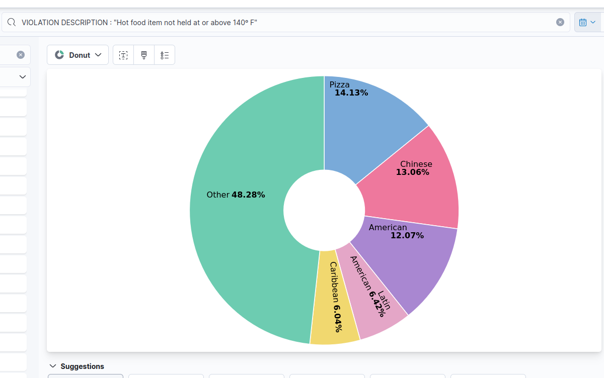


### 2.10 Determine the most common violations (Top 5)

On agrège sur les VIOLATION CODE et on affiche la VIOLATION DESCRIPTION avec une taille (size) de 5.
```
  GET restaurantny/_search
{
  "size": 0,
  "aggs": {
    "most_affected_cuisine": {
      "terms": {
        "field": "VIOLATION CODE",
        "size": 5,
        "order": { "_count": "desc" }
      },
      "aggs": {
        "sample_description": {
          "top_hits": {
            "_source": ["VIOLATION DESCRIPTION"],
            "size": 1
          }
        }
      }
    }
  }
}
```

resultat
```
"aggregations": {
    "most_affected_cuisine": {
      "doc_count_error_upper_bound": 0,
      "sum_other_doc_count": 161778,
      "buckets": [
        {
          "key": "10F",
          "doc_count": 40108,
          "sample_description": {
            "hits": {
              "total": {
                "value": 40108,
                "relation": "eq"
              },
              "max_score": 1,
              "hits": [
                {
                  "_index": "restaurantny",
                  "_id": "qROH3JkByv84jpscZM78",
                  "_score": 1,
                  "_source": {
                    "VIOLATION DESCRIPTION": "Non-food contact surface or equipment made of unacceptable material, not kept clean, or not properly sealed, raised, spaced or movable to allow accessibility for cleaning on all sides, above and underneath the unit."
                  }
                }
              ]
            }
          }
        },
        {
          "key": "08A",
          "doc_count": 27330,
          "sample_description": {
            "hits": {
              "total": {
                "value": 27330,
                "relation": "eq"
              },
              "max_score": 1,
              "hits": [
                {
                  "_index": "restaurantny",
                  "_id": "sROH3JkByv84jpscZM78",
                  "_score": 1,
                  "_source": {
                    "VIOLATION DESCRIPTION": "Establishment is not free of harborage or conditions conducive to rodents, insects or other pests."
                  }
                }
              ]
            }
          }
        },
        {
          "key": "06D",
          "doc_count": 18552,
          "sample_description": {
            "hits": {
              "total": {
                "value": 18552,
                "relation": "eq"
              },
              "max_score": 1,
              "hits": [
                {
                  "_index": "restaurantny",
                  "_id": "qxOH3JkByv84jpscZM78",
                  "_score": 1,
                  "_source": {
                    "VIOLATION DESCRIPTION": "Food contact surface not properly washed, rinsed and sanitized after each use and following any activity when contamination may have occurred."
                  }
                }
              ]
            }
          }
        },
        {
          "key": "02G",
          "doc_count": 18056,
          "sample_description": {
            "hits": {
              "total": {
                "value": 18056,
                "relation": "eq"
              },
              "max_score": 1,
              "hits": [
                {
                  "_index": "restaurantny",
                  "_id": "xhOH3JkByv84jpscZM78",
                  "_score": 1,
                  "_source": {
                    "VIOLATION DESCRIPTION": "Cold TCS food item held above 41 °F; smoked or processed fish held above 38 °F; intact raw eggs held above 45 °F; or reduced oxygen packaged (ROP) TCS foods held above required temperatures except during active necessary preparation."
                  }
                }
              ]
            }
          }
        },
        {
          "key": "10B",
          "doc_count": 17746,
          "sample_description": {
            "hits": {
              "total": {
                "value": 17746,
                "relation": "eq"
              },
              "max_score": 1,
              "hits": [
                {
                  "_index": "restaurantny",
                  "_id": "shOH3JkByv84jpscZM78",
                  "_score": 1,
                  "_source": {
                    "VIOLATION DESCRIPTION": "Anti-siphonage or back-flow prevention device not provided where required; equipment or floor not properly drained; sewage disposal system in disrepair or not functioning properly. Condensation or liquid waste improperly disposed of."
                  }
                }
              ]
            }
          }
        }
```

le top 5 des violations :

|  Rank | Violation Code | Description                                                                                                                                                                                                                               | Number of Occurrences |
| :---: | :------------- | :---------------------------------------------------------------------------------------------------------------------------------------------------------------------------------------------------------------------------------------- | :-------------------: |
| **1** | **10F**        | Non-food contact surface or equipment made of unacceptable material, not kept clean, or not properly sealed, raised, spaced, or movable to allow accessibility for cleaning on all sides, above and underneath the unit.                  |       **40 108**      |
| **2** | **08A**        | Establishment is not free of harborage or conditions conducive to rodents, insects, or other pests.                                                                                                                                       |       **27 330**      |
| **3** | **06D**        | Food contact surface not properly washed, rinsed, and sanitized after each use and following any activity when contamination may have occurred.                                                                                           |       **18 552**      |
| **4** | **02G**        | Cold TCS food item held above 41 °F; smoked or processed fish held above 38 °F; intact raw eggs held above 45 °F; or reduced-oxygen packaged (ROP) TCS foods held above required temperatures except during active necessary preparation. |       **18 056**      |
| **5** | **10B**        | Anti-siphonage or back-flow prevention device not provided where required; equipment or floor not properly drained; sewage disposal system in disrepair or not functioning properly; condensation or liquid waste improperly disposed of. |       **17 746**      |

#### visualisation

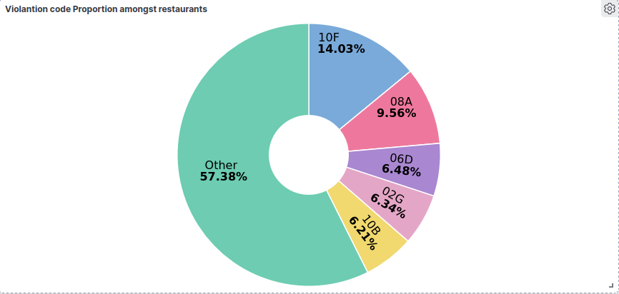

### 2.11 Identify the most popular restaurant chain

Je dois effectuer une agrégation sur les DBA des restaurants uniques (cardinalité sur CAMIS).

Pour la dernière requête, ma mémoire n’est pas suffisante, je dois donc optimiser la requête. Plusieurs possibilités s’offrent à moi :

Effectuer la requête sur un échantillon (sample).

Réduire la précision de la cardinalité.

Exécuter la requête en batch (manuellement ou via un script) afin d’obtenir un résultat exact.

Pour le projet, j’ai choisi de réduire le seuil de précision de la cardinalité de 3000 à 1000. En effet, la cardinalité dans Elasticsearch repose sur l’algorithme HyperLogLog++, qui effectue un comptage approximatif.
On peut donc réduire la précision afin de gagner en puissance de calcul. (https://www.elastic.co/docs/reference/aggregations/search-aggregations-metrics-cardinality-aggregation)

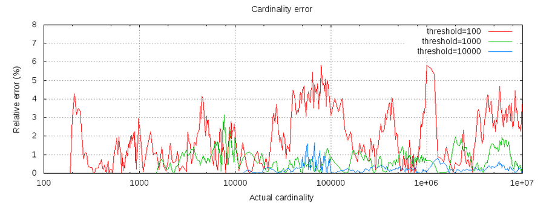

Pour verifier la pertinence du resultat, On verifie le nombre de document compté avec une aggregation classique

```
GET restaurantny_final/_search
{
  "size": 0,
"aggs": {
    "restaurants_by_DBA": {
      "terms": {
        "field": "DBA.keyword",
        "size": 3,
        "order": { "_count": "desc" }
      }}}

}
```

reponse
```
"aggregations": {
    "restaurants_by_DBA": {
      "doc_count_error_upper_bound": 0,
      "sum_other_doc_count": 282779,
      "buckets": [
        {
          "key": "DUNKIN",
          "doc_count": 3241
        },
        {
          "key": "SUBWAY",
          "doc_count": 2003
        },
        {
          "key": "STARBUCKS",
          "doc_count": 1547
        }
      ]
    }
  }
```
On compte 3 241 documents pour DUNKIN, 2 003 pour SUBWAY et 1 547 pour STARBUCKS.
Il est probable que l’on retrouve le même top 3 pour les restaurants uniques, en tenant compte de la corrélation entre le nombre d’inspections et le nombre de restaurants.

requête avec une agrégation de cardinalité sur CAMIS et un seuil de précision fixé à 1500 :
```
GET restaurantny_final/_search
{
  "size": 0,

  "aggs": {
    "restaurants_by_DBA": {
      "terms": {
        "field": "DBA.keyword",
        "size": 3,
        "order": { "unique_restaurants.value": "desc" }
      },
      "aggs": {
        "unique_restaurants": {
          "cardinality": {
            "field": "CAMIS",
              "precision_threshold": 1500
          }
        }
      }
    }
  }
}
```

reponse

```
"aggregations": {
    "restaurants_by_DBA": {
      "doc_count_error_upper_bound": -1,
      "sum_other_doc_count": 282779,
      "buckets": [
        {
          "key": "DUNKIN",
          "doc_count": 3241,
          "unique_restaurants": {
            "value": 348
          }
        },
        {
          "key": "STARBUCKS",
          "doc_count": 1547,
          "unique_restaurants": {
            "value": 209
          }
        },
        {
          "key": "SUBWAY",
          "doc_count": 2003,
          "unique_restaurants": {
            "value": 176
          }
        }
      ]
    }
  }
```

On obtient le même nombre de document, le seuil de precision a 1500 est donc suffisament precise, avec en top 3:

* Dukin : 348 restaurant
* STARBUCKS : 209 restaurant
* SUBWAY : 176 restaurant

DUKIN est donc le restaurant le plus populaire par nombre de restaurant.

#### visualisation

Table des restaurant par nombre.
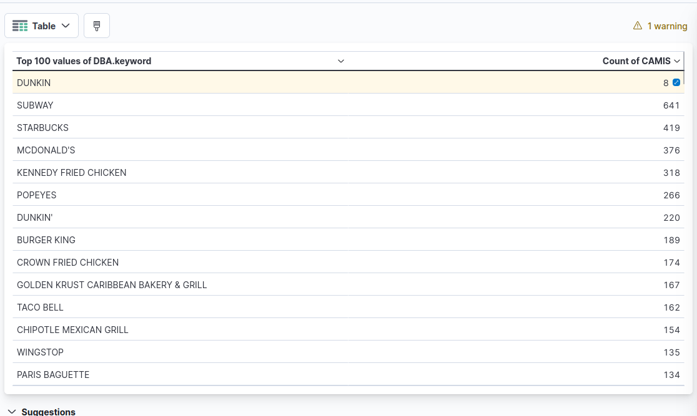

barchart des restaurants par nombre.
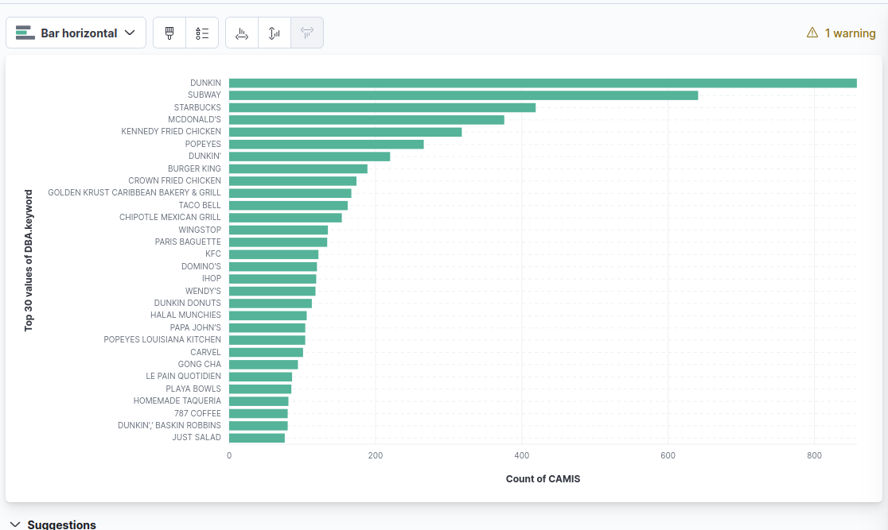

On remarque la présence de DUNKIN et DUNKIN'. Il serait possible de refaire l’index afin de supprimer les caractères spéciaux, mais cela risquerait également d’agréger des restaurants différents.
Nous estimons donc que notre degré de précision actuel est suffisant.

## Dashboard

Visualisez le dashboard regroupant les visualisation ici :

http://localhost:5601/app/r/s/6ns45

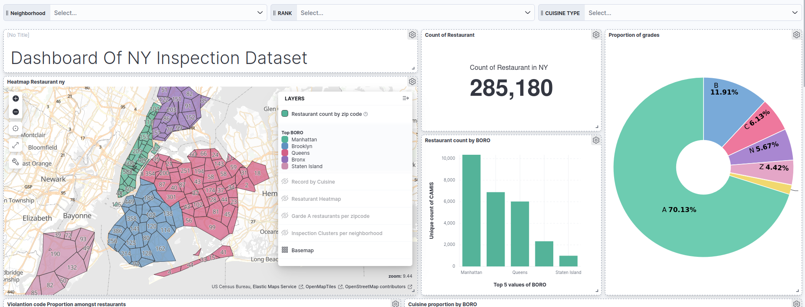
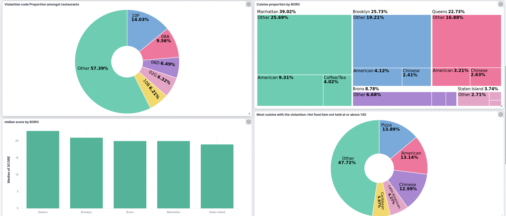
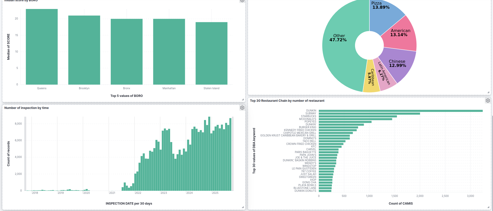

## Visualisation with MAP

### Nombre d'inspection par zipcode en fonction du type de cuisine.

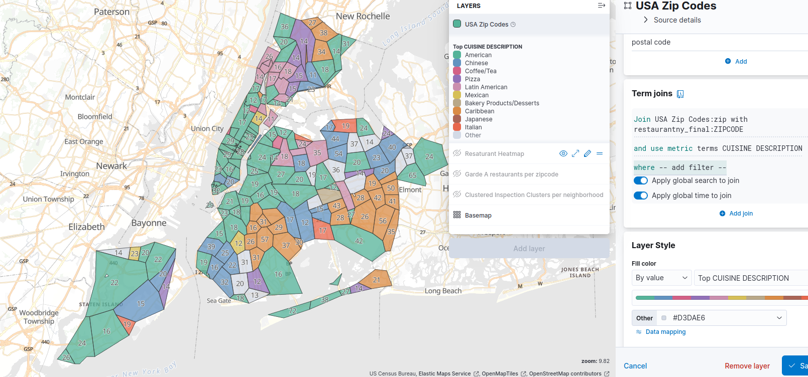

### Cluster des inspection par quartier.

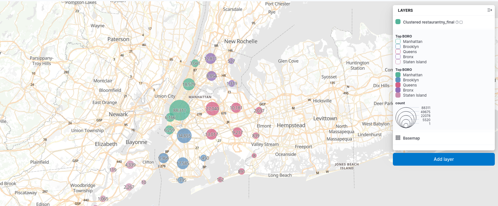

### Carte du nombre de restaurant par quartier.


### Heatmap des restaurant.

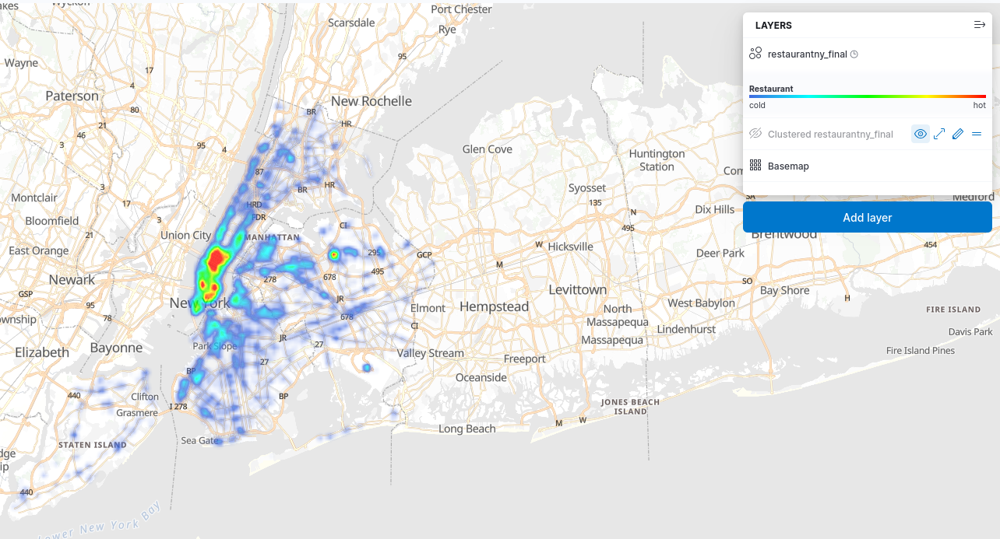

### repartition des restaurants en clusters.

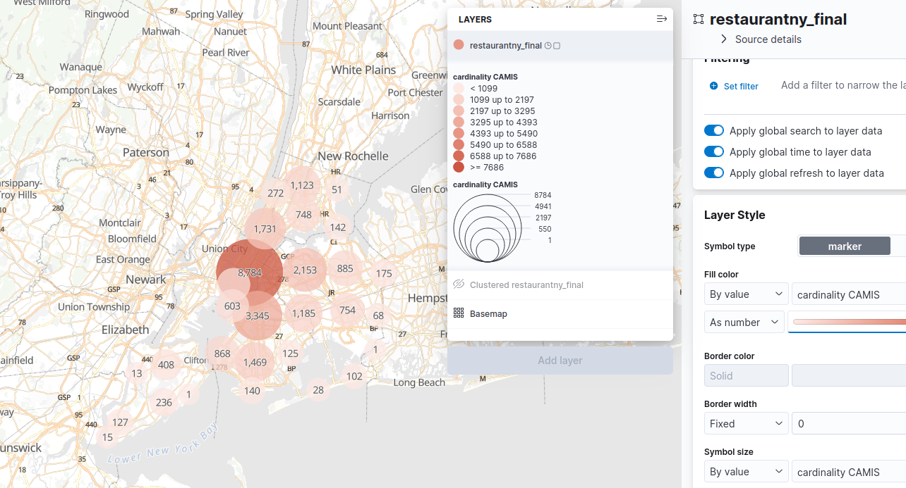

### Restaurant à la note de A par zipcode

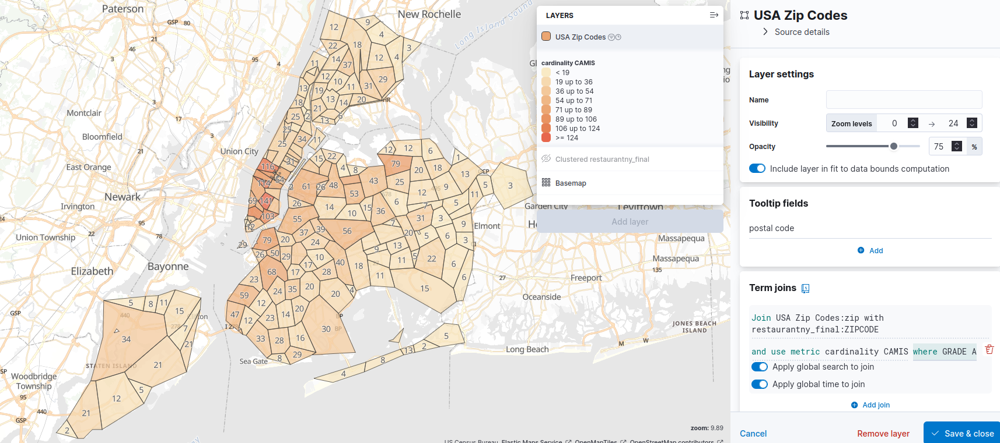
