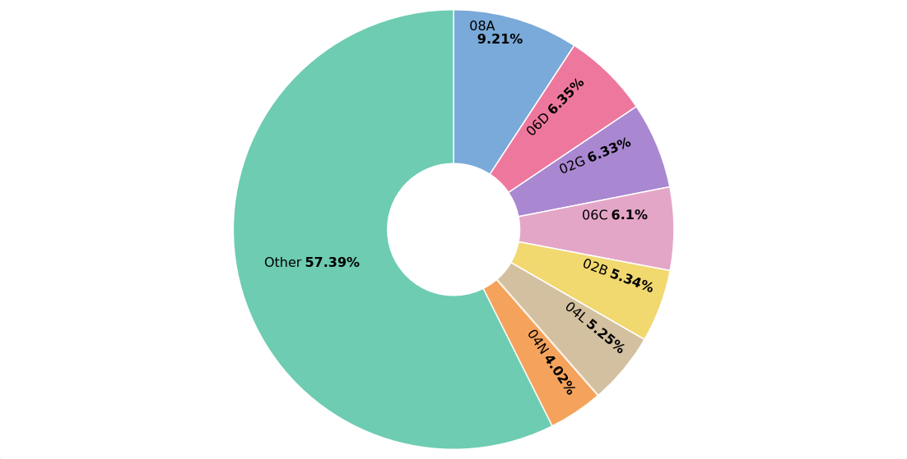
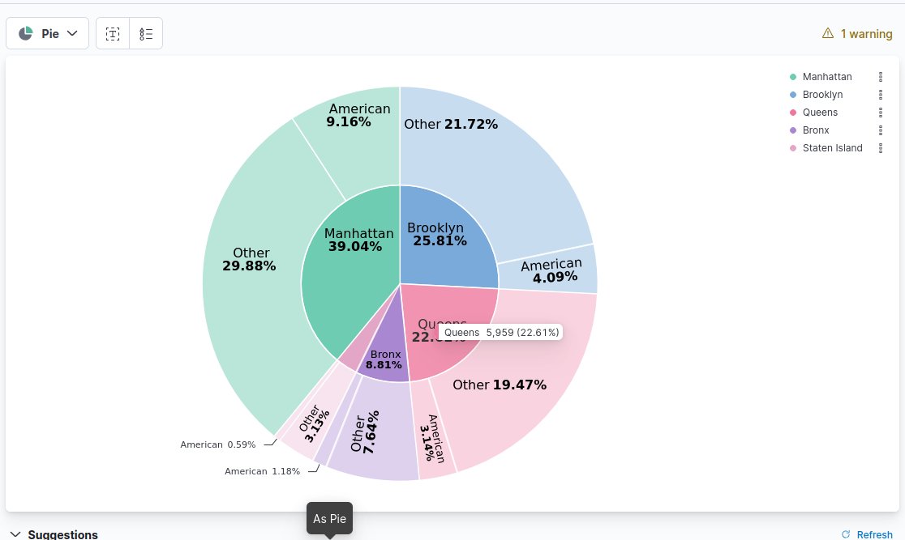
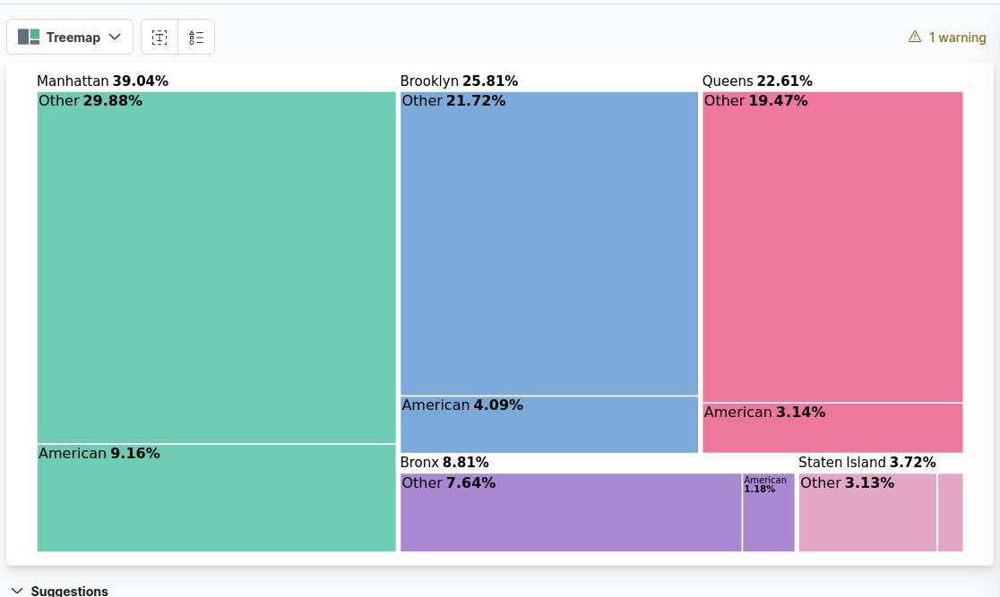
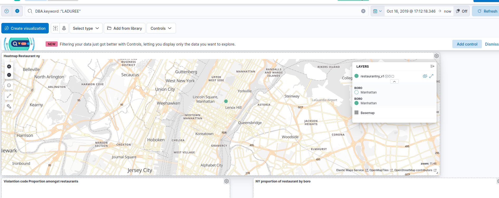
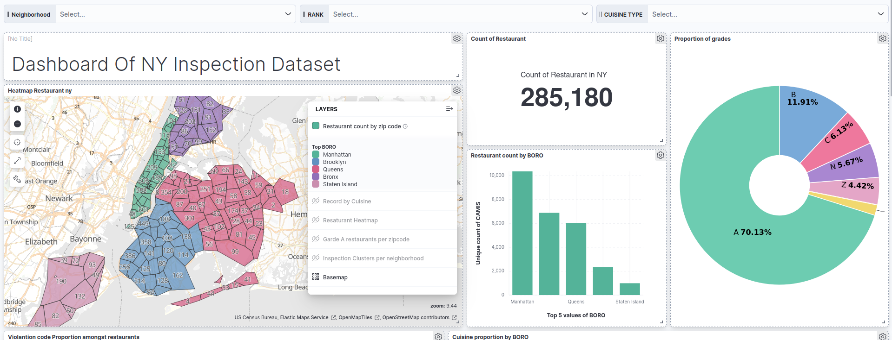
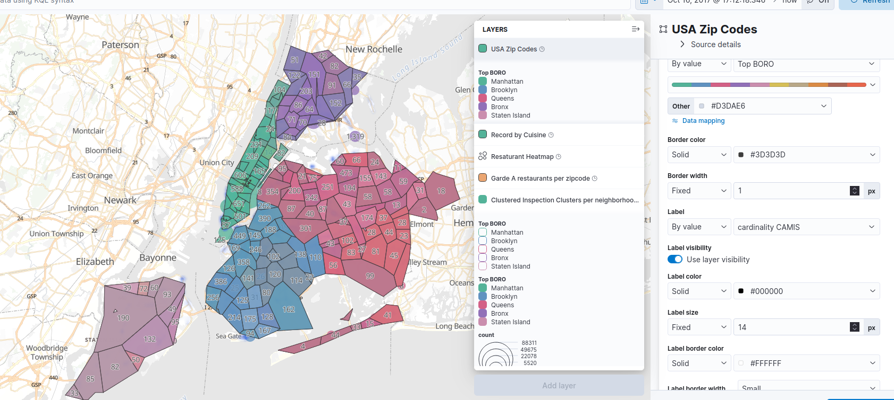

# Project: NYC Restaurant Inspection Data

**Noé Breton** et **Reda Bourssouf**

## Installation d’Elasticsearch

On utilise Docker Compose et la commande ```docker compose up -d``` pour lancer Elasticsearch et Kibana.

```yaml
version: '3.8'

services:
  elasticsearch:
    image: docker.elastic.co/elasticsearch/elasticsearch:8.4.2
    container_name: elasticsearch
    environment:
      - node.name=elasticsearch
      - cluster.name=es-docker-cluster
      - discovery.type=single-node
      - bootstrap.memory_lock=true
      - "ES_JAVA_OPTS=-Xms512m -Xmx512m"
      # Security settings for development
      - xpack.security.enabled=false
      - xpack.security.enrollment.enabled=false
      - xpack.security.http.ssl.enabled=false
      - xpack.security.transport.ssl.enabled=false
    ulimits:
      memlock:
        soft: -1
        hard: -1
    volumes:
      - es_data:/usr/share/elasticsearch/data
    ports:
      - "9200:9200"
      - "9300:9300"
    networks:
      - elastic
    healthcheck:
      test: ["CMD-SHELL", "curl -f http://localhost:9200/_cluster/health || exit 1"]
      interval: 30s
      timeout: 10s
      retries: 5

  kibana:
    image: docker.elastic.co/kibana/kibana:8.4.2
    container_name: kibana
    environment:
      - ELASTICSEARCH_HOSTS=http://elasticsearch:9200
      - ELASTICSEARCH_USERNAME=kibana_system
      - ELASTICSEARCH_PASSWORD=
    ports:
      - "5601:5601"
    networks:
      - elastic
    depends_on:
      elasticsearch:
        condition: service_healthy
    healthcheck:
      test: ["CMD-SHELL", "curl -f http://localhost:5601/api/status || exit 1"]
      interval: 30s
      timeout: 10s
      retries: 5

volumes:
  es_data:
    driver: local

networks:
  elastic:
    driver: bridge
```

## Ingestion

On cherche à ingérer [NYC Restaurant Inspection Results](https://data.cityofnewyork.us/Health/DOHMH-New-York-City-Restaurant-Inspection-Results/43nn-pn8j/about_data).

La taille limite de fichier à ingérer est par défaut de 100 MB, mais le CSV à ingérer fait 123 MB. On change donc la limite à 150 MB dans les paramètres avancés.


---

## 2. Questions

### 2.1 List all the neighborhoods in New York

Par une agrégation sur la colonne **BORO**, on récupère les quartiers uniques ainsi que leur nombre d’occurrences.

```json
GET /restaurantny/_search
{
  "size": 0,
  "aggs": {
    "unique_boro": {
      "terms": {
        "field": "BORO",
        "size": 100
      }
    }
  }
}
```

---

### Visualisation

Cette visualisation montre clairement tous les quartiers de New York et les restaurants présents à l’intérieur.


---

### 2.2 Which neighborhood has the most restaurants?

La commande précédente peut être reprise pour récupérer le quartier avec le plus de restaurants, en vérifiant que l’ordonnancement est bien décroissant et en ajoutant `size: 1` pour obtenir uniquement le premier résultat.
On ajoute une agrégation de **cardinalité** sur l’ID unique (`CAMIS`) pour obtenir le nombre de restaurants.

```json
GET restaurantny/_search
{
  "size": 0,
  "aggs": {
    "restaurants_by_boro": {
      "terms": {
        "field": "BORO",
        "size": 1,
        "order": { "unique_restaurants.value": "desc" }
      },
      "aggs": {
        "unique_restaurants": {
          "cardinality": {
            "field": "CAMIS"
          }
        }
      }
    }
  }
}
```

**Résultat :**

Manhattan possède **12 113 restaurants**, ce qui en fait le quartier avec la plus grande offre de restauration.

#### Visualisation

On peut reprendre la carte précédente en ajoutant des labels pour estimer la densité de restaurants par quartier. Cependant, un barchart est plus lisible.


---

### 2.3 What does the violation code "04N" correspond to?

On extrait l’attribut **VIOLATION DESCRIPTION** (et **VIOLATION CODE** pour vérification) d’une ligne dont **VIOLATION CODE** vaut `"04N"`.

```json
GET restaurantny/_search
{
  "_source": ["VIOLATION DESCRIPTION", "VIOLATION CODE"],
  "query": {
    "term": {
      "VIOLATION CODE": "04N"
    }
  },
  "size": 1
}
```

Le code **04N** correspond à la **présence de mouches ou d’autres nuisibles** dans les zones de préparation, de stockage ou de service des aliments.

#### Visualisation

Voici la proportion des codes de violation présents dans les restaurants enregistrés.
On voit que **10F** est le plus fréquent.



---

### 2.4 Where are the restaurants (name, address, neighborhood) that have a grade of A?

```json
GET restaurantny/_search
{
  "_source": ["DBA", "BUILDING", "STREET", "ZIPCODE", "BORO", "GRADE"],
  "query": {
    "term": { "GRADE": "A" }
  },
  "size": 100
}
```

#### Visualisation

L’outil de visualisation ne permet pas d’utiliser **DBA** comme métrique.
J’ai donc affiché la proportion des notes parmi tous les restaurants.
Les outils dynamiques du dashboard permettent d’ajuster la granularité.


On peut aussi ajouter la médiane des scores par **BORO** : le **Queens** a la meilleure médiane.


---

### 2.5 What is the most popular cuisine? And by neighborhood?

La cuisine la plus populaire à New York est **la cuisine américaine**, avec **4 964 restaurants**, suivie par **la cuisine chinoise** et les **Coffee/Tea shops**.

Par **BORO**, la tendance reste la même : l’américaine domine partout.

| **BORO**      | **Cuisine la plus populaire** | **Nombre de restaurants** |
| ------------- | ----------------------------- | ------------------------- |
| Manhattan     | American                      | 2476                      |
| Brooklyn      | American                      | 1094                      |
| Queens        | American                      | 854                       |
| Bronx         | American                      | 317                       |
| Staten Island | American                      | 164                       |

#### Visualisation

On peut utiliser un **pie chart** ou un **waffle chart**, voire une **mosaïque** pour comparer les cuisines par BORO.




---

### 2.6 What is the date of the last inspection?

```json
GET restaurantny/_search
{
  "_source": ["INSPECTION DATE", "DBA"],
  "sort": [{ "INSPECTION DATE": { "order": "desc" } }],
  "size": 1
}
```

La dernière inspection date du **10/09/2025** et concerne **LE PETIT MONSTRE**.

#### Visualisation

Un diagramme temporel (barres ou lignes) permet de visualiser l’évolution du nombre d’inspections dans le temps.


---

### 2.7 Provide a list of Chinese restaurants with an A grade in Brooklyn

```json
GET restaurantny/_search
{
  "_source": ["DBA"],
  "query": {
    "bool": {
      "must": [
        { "term": { "CUISINE DESCRIPTION": "Chinese" } },
        { "term": { "GRADE": "A" } },
        { "term": { "BORO": "Brooklyn" } }
      ]
    }
  }
}
```

#### Visualisation

On peut utiliser les contrôles du dashboard pour obtenir la liste des restaurants correspondant à ces critères.


---

### 2.8 Provide the address of the restaurant LADURÉE

Après reindexation avec le champ `DBA.keyword`, on trouve l’adresse du restaurant **LADURÉE : 864 MADISON AVENUE, Manhattan**.



---

### 2.9 Identify the cuisine most affected by the violation

**“Hot food item not held at or above 140º F”**

La cuisine la plus affectée par cette violation est **Pizza**.

#### Visualisation

Pie chart avec le filtre correspondant.


---

### 2.10 Determine the most common violations (Top 5)

| **Rank** | **Violation Code** | **Description**                                                                                                                                                     | **Occurrences** |
| :------: | :----------------- | :------------------------------------------------------------------------------------------------------------------------------------------------------------------ | :-------------- |
|     1    | 10F                | Non-food contact surface or equipment made of unacceptable material, not kept clean, or not properly sealed, raised, spaced, or movable for cleaning accessibility. | 40 108          |
|     2    | 08A                | Establishment not free of rodents, insects, or other pests.                                                                                                         | 27 330          |
|     3    | 06D                | Food contact surface not properly washed, rinsed, and sanitized.                                                                                                    | 18 552          |
|     4    | 02G                | Cold TCS food held above required temperatures.                                                                                                                     | 18 056          |
|     5    | 10B                | Anti-siphonage/back-flow device missing or drainage issues.                                                                                                         | 17 746          |


---

### 2.11 Identify the most popular restaurant chain

Après optimisation (cardinalité avec `precision_threshold: 1500`), le classement est :

1. **DUNKIN** : 348 restaurants
2. **STARBUCKS** : 209 restaurants
3. **SUBWAY** : 176 restaurants

DUNKIN est donc la chaîne la plus populaire.


---

## Dashboard

Visualisez le dashboard regroupant toutes les visualisations ici :
[http://localhost:5601/app/r/s/6ns45](http://localhost:5601/app/r/s/6ns45)




---

## Visualisation with MAP

### Nombre de documents par ZIP code selon le type de cuisine


### Clusters des inspections par voisinage


### Restaurants par voisinage



### Heatmap of Unique Restaurants


### Clusters of Restaurants


### Restaurants ayant la note A par ZIP code


```
```
